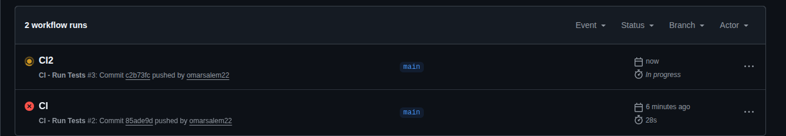

# Travel Destination Planner

A full-stack travel planning application built with **Spring Boot** and **Angular**, featuring role-based dashboards for admins and users, REST Countries API integration, and a wishlist system.

---

### Prerequisites

Docker & Docker Compose

### Run with Docker

```bash
# 1. Clone the repository
git clone https://github.com/omarsalem22/Development-Task.git
cd Development-Task

# 2. Run this
docker-compose up --build

# 3. Open the app
# Frontend → http://localhost:4200  - > this will take you to login page
# you can sign as admin how is eamil `omar@salem.com`  , password 123456789
# Backend  → http://localhost:8080
```

To stop:

```bash
docker-compose down

## Default Accounts

The application seeds default accounts on startup:

| Role  | Email            | Password    |
| ----- | ---------------- | ----------- |
| Admin | `omar@salem.com` | `123456789` |

> The first user registered via the API also gets ADMIN role automatically.

---

## Features

### Admin Dashboard

- Secure login with JWT authentication
- Fetch 250+ destinations from the [REST Countries API](https://restcountries.com)
- Add destinations individually or bulk-add selected countries
- Remove destinations from the database (soft delete)
- View all saved destinations with full details

### User Dashboard

- Secure login with JWT authentication
- Browse all approved destinations in a paginated card grid
- Real-time search
- View destination details: country, capital, region, population, currency, flag
- Mark destinations as "Want to Visit" (wishlist toggle)

### Auth System

- Register with username, email, and password
- Login returns JWT token with role
- First registered user is automatically assigned ADMIN role
- All subsequent users are assigned USER role
- Route guards protect admin and user dashboards

---


## Continus integration




## Tech Stack

### Backend

| Technology                  | Purpose                        |
| --------------------------- | ------------------------------ |
| Java 17                     | Language                       |
| Spring Boot 3               | Framework                      |
| Spring Security + JWT       | Authentication & Authorization |
| Spring Data JPA + Hibernate | ORM & Database access          |
| PostgreSQL                  | Database                       |
| JDBC Template               | Bulk insert performance        |
| REST Countries API          | External destination data      |
| Maven                       | Build tool                     |

### Frontend

| Technology     | Purpose                       |
| -------------- | ----------------------------- |
| Angular 17+    | Framework                     |
| TypeScript     | Language                      |
| Reactive Forms | Form handling & validation    |
| RxJS           | Async data streams & debounce |
| Angular Router | Navigation & route guards     |
| SCSS           | Styling                       |

### DevOps

| Technology     | Purpose                         |
| -------------- | ------------------------------- |
| Docker         | Containerization                |
| Docker Compose | Multi-container orchestration   |
| Nginx          | Frontend server & reverse proxy |

---

## Project Structure

```

travel-destination-planner/
├── backend/
│ ├── src/main/java/faw/backend/
│ │ ├── config/
│ │ │ ├── SecurityConfig.java
│ │ │ ├── JwtAuthenticationFilter.java
│ │ │ └── ApplicationConfig.java
│ │ ├── controller/
│ │ │ ├── AuthController.java
│ │ │ ├── AdminController.java
│ │ │ ├── DestinationController.java
│ │ │ └── WishlistController.java
│ │ ├── service/
│ │ │ ├── AuthService.java
│ │ │ ├── AdminService.java
│ │ │ ├── DestinationService.java
│ │ │ ├── WishlistService.java
│ │ │ └── RestCountriesService.java
│ │ ├── entity/
│ │ │ ├── User.java
│ │ │ ├── Destination.java
│ │ │ └── Wishlist.java
│ │ ├── repository/
│ │ │ ├── UserRepository.java
│ │ │ ├── DestinationRepository.java
│ │ │ └── WishlistRepository.java
│ │ └── dto/
│ │ ├── DestinationDTO.java
│ │ ├── LoginRequest.java
│ │ ├── LoginResponse.java
│ │ └── RegisterRequest.java
│ ├── Dockerfile
│ └── pom.xml
│
├── frontend/
│ ├── src/app/
│ │ ├── auth/
│ │ │ ├── login/
│ │ │ └── register/
│ │ ├── admin/
│ │ │ └── dashboard/
│ │ ├── user/
│ │ │ └── dashboard/
│ │ ├── services/
│ │ │ ├── auth-service.ts
│ │ │ ├── admin.service.ts
│ │ │ ├── destination.service.ts
│ │ │ └── wishlist.service.ts
│ │ ├── models/
│ │ │ ├── auth.ts
│ │ │ └── destination.model.ts
│ │ ├── guards/
│ │ │ └── auth-guard.ts
│ │ ├── interceptors/
│ │ │ └── auth-interceptor.ts
│ │ ├── app.routes.ts
│ │ └── app.config.ts
│ ├── nginx.conf
│ └── Dockerfile
│
└── docker-compose.yml

```

---

## API Endpoints

### Auth — `/api/auth`

| Method | Endpoint             | Access | Description           |
| ------ | -------------------- | ------ | --------------------- |
| POST   | `/api/auth/register` | Public | Register new user     |
| POST   | `/api/auth/login`    | Public | Login and receive JWT |

### Destinations — `/api/destinations`

| Method | Endpoint                                   | Access | Description                |
| ------ | ------------------------------------------ | ------ | -------------------------- |
| GET    | `/api/destinations?page=0&size=10&search=` | User   | Paginated destination list |
| GET    | `/api/destinations/{id}`                   | User   | Single destination         |

### Admin — `/api/admin`

| Method | Endpoint                       | Access | Description                   |
| ------ | ------------------------------ | ------ | ----------------------------- |
| GET    | `/api/admin/fetch`             | Admin  | Fetch from REST Countries API |
| GET    | `/api/admin/destinations`      | Admin  | Get all saved destinations    |
| POST   | `/api/admin/destinations`      | Admin  | Add single destination        |
| POST   | `/api/admin/destinations/bulk` | Admin  | Bulk add destinations         |
| DELETE | `/api/admin/destinations/{id}` | Admin  | Remove destination            |

### Wishlist — `/api/wishlist`

| Method | Endpoint                        | Access | Description         |
| ------ | ------------------------------- | ------ | ------------------- |
| GET    | `/api/wishlist`                 | User   | Get user's wishlist |
| POST   | `/api/wishlist/{destinationId}` | User   | Toggle wishlist     |

---

## Database Schema

```

users
├── id (PK)
├── username (unique)
├── email (unique)
├── password (bcrypt)
└── role (ADMIN / USER)

destinations
├── id (PK)
├── name
├── capital
├── region
├── population
├── currency
├── flag_url
├── country_code (unique)
└── status (APPROVED / REMOVED)

wishlist
├── id (PK)
├── user_id (FK → users)
├── destination_id (FK → destinations)
└── created_at

```

---


# stop and remove database volume
docker-compose down -v
```

## Environment Variables

| Variable                     | Default                                      | Description                      |
| ---------------------------- | -------------------------------------------- | -------------------------------- |
| `SPRING_DATASOURCE_URL`      | `jdbc:postgresql://localhost:5432/travel_db` | Database URL                     |
| `SPRING_DATASOURCE_USERNAME` | `postgres`                                   | DB username                      |
| `SPRING_DATASOURCE_PASSWORD` | `postgres`                                   | DB password                      |
| `APP_JWT_SECRET`             | —                                            | JWT signing secret (min 256-bit) |
| `APP_JWT_EXPIRATION`         | `86400000`                                   | Token expiry in ms (24h)         |

---

---

### Login

![Login page with email and password fields]

### Admin Dashboard

![Admin dashboard with fetch from API, bulk-add, and saved destinations table]

### User Dashboard

![Destination cards grid with flag images, details, and wishlist hearts]

---

## How Bulk Insert Works

When an admin selects multiple countries and clicks "Add Selected", the backend uses `JdbcTemplate.batchUpdate()` instead of `JpaRepository.saveAll()`:

```java
jdbcTemplate.batchUpdate(sql, dtos, 50, (ps, dto) -> {
    ps.setString(1, dto.getName().getCommon());
    // ...
});
```

This processes destinations in batches of 50, significantly faster than individual inserts for large datasets.

---

## Security

- Passwords are hashed with **BCrypt**
- JWT tokens expire after **24 hours**
- All `/api/admin/**` routes require `ADMIN`
- All `/api/destinations/**` and `/api/wishlist/**` routes require authentication
- CORS is configured to allow only `http://localhost:4200`

## Author

**Omar Mohamed Ali**  
[LinkedIn](https://www.linkedin.com/in/omar-salem-b17a4a213/) · [GitHub](https://github.com/omarsalem22)
